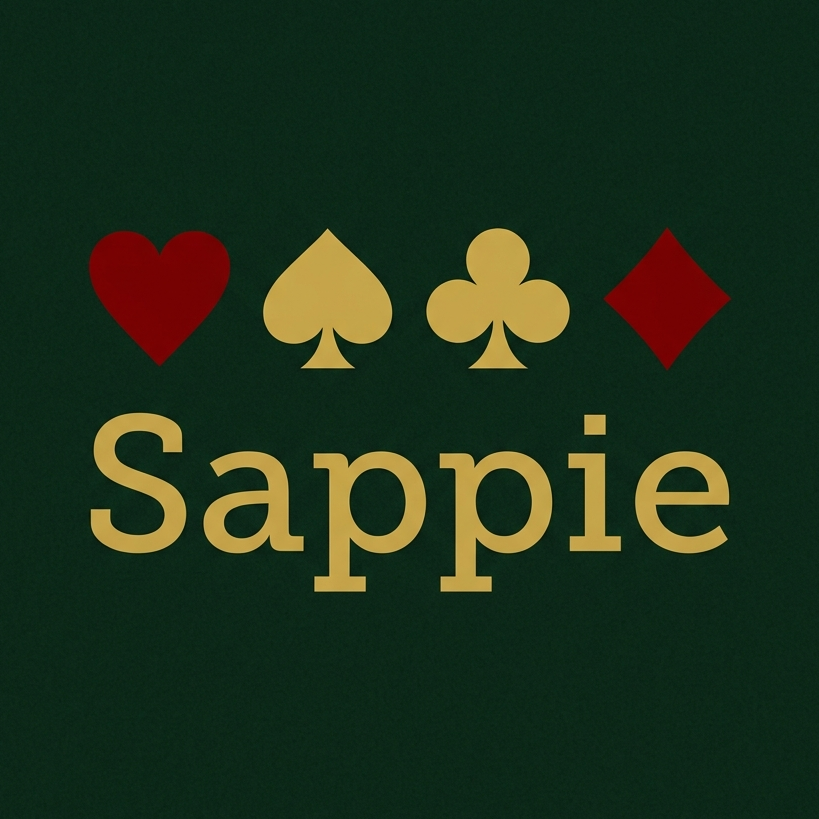

# Sappie

<p align="center">
  
</p>

[](https://nextjs.org/)
[](https://react.dev/)
[](https://www.typescriptlang.org/)
[](https://tailwindcss.com/)
[](https://opensource.org/licenses/GPL-3.0)

**Sappie** is a two-page card game reference site. Page one is a browsable encyclopedia of card game rules. Page two is an animated step-by-step visualizer for card shuffling, dealing, and flourish techniques — like an algorithm visualizer, but for playing cards.

It is **not** a playable card game. There is no game engine, no multiplayer, and no gambling strategy. The goal is to help people learn what to play and how to handle cards before they sit down at the table.

---

## Features

- **Game encyclopedia**: Browse 15 card games with full rules broken into Setup, Turn Structure, Winning Condition, and Variants.
- **Category filter**: Filter games by trick-taking, shedding, matching, casino, patience, or bluffing.
- **Search**: Real-time name search, combined with category filter.
- **Difficulty & player count**: Visual pip indicators and player count on every game card.
- **Shuffle & deal visualizer**: Animated step-by-step breakdown of 10 shuffles and deals.
- **Flourishes**: Card fan, spring cards, and Charlier cut visualized with the same step engine.
- **Playback controls**: Play, pause, step forward, step back, reset, skip to end.
- **Speed slider**: 0.5× to 3× playback speed.
- **Keyboard shortcuts**: Space = play/pause, ArrowLeft = step back, ArrowRight = step forward.
- **"Why this technique?"**: Context note for every visualized technique.
- **Statically generated**: All game pages pre-rendered at build time.
- **Dark felt aesthetic**: Card-table green theme throughout.

---

## Games Covered

Poker (Texas Hold'em), Blackjack, Rummy, Go Fish, War, Snap, Solitaire (Klondike), Crazy Eights, Spades, Hearts, Bridge, Durak, Old Maid, Sevens, Speed.

---

## Techniques Covered

### Shuffles
Overhand, Riffle, Hindu, Pile, Faro, Wash

### Deals
Round-Robin, Batch, Stud, Burn Card

### Flourishes
Card Fan, Spring Cards, Charlier Cut

---

## Quick Start

### Clone

```bash
git clone https://github.com/DraSoGo/Sappie.git
cd Sappie/sappie
```

### Run Locally

```bash
npm install
npm run dev
```

Then open the URL shown in the terminal (default: `http://localhost:3000`).

### Build

```bash
npm run build
```

Runs TypeScript checks and produces a production build.

### Start Production Server

```bash
npm run start
```

---

## Project Layout

```text
sappie/
├── README.md
├── package.json
└── src/
    ├── app/
    │   ├── layout.tsx          # root layout, navbar, footer
    │   ├── page.tsx            # landing page
    │   ├── games/
    │   │   ├── page.tsx        # game encyclopedia list
    │   │   └── [slug]/
    │   │       └── page.tsx    # game detail (statically generated)
    │   └── shuffle/
    │       └── page.tsx        # shuffle/deal/flourish visualizer
    ├── components/
    │   ├── shared/             # Navbar, Footer
    │   ├── games/              # GameCard, GameDetail, CategoryFilter, SearchBar
    │   └── shuffle/            # Visualizer, CardComponent, PlaybackControls,
    │                           # SpeedSlider, StepDescription, TechniqueSelector
    ├── data/
    │   ├── games/              # one file per game, index.ts
    │   └── techniques/         # one file per technique, index.ts
    ├── store/
    │   └── visualizer.ts       # Zustand playback state
    ├── lib/
    │   └── animator.ts         # transition duration helpers
    └── types/
        ├── game.ts
        └── technique.ts
```

---

## Technical Stack

- **Next.js 16** (App Router, static generation)
- **React 19**
- **TypeScript**
- **Tailwind CSS v4** (CSS-variable `@theme` config)
- **Framer Motion** for card position interpolation
- **Zustand** for visualizer playback state
- **Lucide React** for icons

---

## Development Notes

- Animation uses Framer Motion `motion.div` with `layoutId` — no canvas, no physics, pure CSS transform interpolation.
- Technique steps are full card snapshots (not deltas). Framer Motion interpolates between them.
- All game pages are statically generated via `generateStaticParams`.
- No automated test suite. TypeScript checks run as part of `npm run build`.

---

## Deployment

Static Next.js export. Deploy to any provider that supports Node.js or static output.

Typical Vercel flow:

```bash
npm run build
```

Push to GitHub and connect the repo to Vercel — zero config needed.

---

## Support

If Sappie is useful to you, you can support the project here:

[Support Me](https://buymeacoffee.com/drasogo)

---

## License

This project is licensed under the **MIT** License.

---

<p align="center">
  <i>Sappie — learn card games, master the shuffle.</i>
</p>
